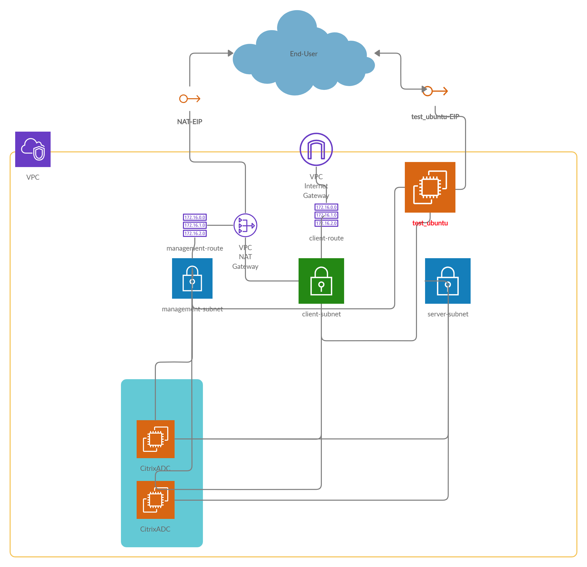

# Automating Citrix ADC Cluster - for CUSTOMERNAME
- [Pre-requisities](#pre-requisities)
- [Folder Structure](#folder-structure)
  * [Terraform related files](#terraform-related-files)
  * [Python script related files](#python-script-related-files)
- [Topology](#topology)
- [Input File `input.auto.tfvars`](#input-file-inputautotfvars)
  * [Possible values for `ns_instance_type`](#possible-values-for-ns_instance_type)
- [Assumptions](#assumptions)
- [What does the Solution do](#what-does-the-solution-do)
  * [Role of Terraform tool](#role-of-terraform-tool)
  * [Role of `cluster.py` script](#role-of-clusterpy-script)
  * [Role of `getCCOId.py` script](#role-of-getccoidpy-script)

The below documentation provides an overview on the provisioning of Citrix ADC clustering using Terraform tool

## Pre-requisities
1. Terraform v.12.0+
2. Space for **two** EIPs in the aws_region
3. python3

## Folder Structure
### Terraform related files
1. `input.auto.tfvars` - user input file to Terraform
2. `main.tf` - all Terraform resources are present here
3. `variables.tf` - all Terraform variables are declared here
4. `outputs.tf` - all Terraform output variables are declared here

### Python script related files
1. `cluster.py` - used to create and manage cluster. This file will be internally called by Terraform
2. `getCCOId.py` - used to get the latest Cluster Coordinator Node ID. It also gets the current number of nodes present in the cluster.
> **Always run `getCCOId.py` script to `refresh terraform`, before modifying cluster.**
## Topology

## Input File `input.auto.tfvars`
// aws authentication

**`aws_access_key`**  =  ""

**`aws_secret_key`**  =  ""

**`ssh_pub_key`**  =  "" // The public key material. Eg., contents of `~/.ssh/id_rsa.pub` file

**`private_key_path`** = "~/.ssh/id_rsa"  // path of the private key

// aws region related inputs

**`aws_region`**  =  "" // default: "us-east-1"

**`aws_availability_zone`**  =  "" // default: "us-east-1a"

// VPC related inputs

**`vpc_cidr_block`**  =  "10.0.0.0/16"

**`management_subnet_cidr_block`**  =  "10.0.1.0/24"

**`client_subnet_cidr_block`**  =  "10.0.2.0/24"

**`server_subnet_cidr_block`**  =  "10.0.3.0/24"

// CitrixADC (node) related inputs

**`ns_instance_type`**  =  "c4.8xlarge" //default: "m4.xlarge" -- [Possible values for `ns_instance_type`](#possible-values-for-ns_instance_type)

**`ns_tenancy_model`**  =  "default"  # defalut | dedicated

**`nodes_password`**  =  "" #default: "nsroot"

**`key_pair_name`**  =  ""

// Cluster related inputs

**`initial_num_nodes`** =  1  # Max is 32

**`cluster_backplane`**  =  "1/1"

**`cluster_tunnel`**  =  "GRE"

### Possible values for `ns_instance_type`
- t2.medium
- t2.large
- t2.xlarge
- t2.2xlarge
- m3.large
- m3.xlarge
- m3.2xlarge
- m4.large
- m4.xlarge
- m4.2xlarge
- m4.4xlarge
- m4.10xlarge
- c4.large
- c4.xlarge
- c4.2xlarge
- c4.4xlarge
- c4.8xlarge

## Assumptions
1. The automation handles only 1 cluster for now
2. All added nodes will go to `state=ACTIVE` by default
3. Addition of nodes will take place **serially**

## What does the Solution do -
There are two components involved.
- `Terraform` Tool - which creates the *infrastructure* such as VPC, subnets, required number of CitrixADCs (nodes)
- `cluster.py` script which helps in managing (add/update/delete) the cluster nodes
- `getCCOId.py` script gets the latest Cluster Coordinator Node ID. It also gets the current number of nodes present in the cluster.
> The output of `getCCOId.py` script will be the input for any `day2+` related changes to the cluster.

### Role of Terraform tool
- Creates a VPC - `Terraform VPC`
- Creates 3 subnets - `management`, `client`, `server`
- Creates 2 security groups - `inside_allow_all`, `outside_world`
- Creates Internet-Gateway - `TR_iGW`
- Creates routing tables - `client_rtb`, `management_rtb`
- Cretees NAT Gatway - `nat_gw`
- Creates ubuntu - `test_ubuntu` - used kind of jumpBox to run `cluster.py` script
- 2 EIPs - one for `test_ubuntu`'s client-side; another for `NAT-GW`
- Role - `citrix_adc_cluster_role`
- 3 ENIs for each CitrixADC - `management`, `server`, `client`
- 2 ENIs for test_ubuntu - `ubuntu_client`, `ubuntu_management`
> Terraform copies `cluster.py` to `test_ubuntu` (acts as jumpBox) and executes it remotely, by passing required arguments.

### Role of `cluster.py` script
- Depending on the arguments, this script adds/updates/deletes the required number of nodes to/from the cluster.

### Role of `getCCOId.py` script
- To run any `Day2+` related changes to cluster, the user require two inputs to `Terraform`.
  1. `cco_id` - The latest Config Coordinator Node ID.
  2. `initial_num_nodes` - The updated number of nodes the user wants to have in the cluster.

