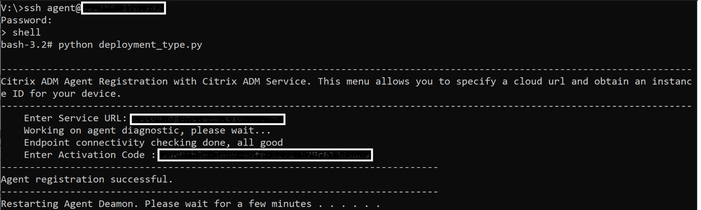

<!-- ## Citrix ADC  -->
## Citrix ADM Agent 

A Citrix ADM Agent enables communication between the Citrix ADM Service and the managed instances(Citrix ADC). Refer [here](https://docs.citrix.com/en-us/citrix-application-delivery-management-service/overview.html) to know more about Citrix ADM Agent and CItrix ADM Service.

## Scripts to provision Citrix ADM agent on Existing Resource Group, Virtual Network and Subnet in Azure

This folder contains the configuration scripts to deploy
* Citrix ADM Agent on Existing Resource Group, Virtual Network and Subnet in Azure
* Register this Citrix ADM Agent to Citrix ADM Service.

## Prerequisits

* Terraform [Installation reference](https://learn.hashicorp.com/tutorials/terraform/install-cli)
* Azure Authentication in Terraform [here](https://github.com/citrix/terraform-cloud-scripts/tree/master/azure#-authenticating-to-azure-in-terraform)
* Before running the terraform scripts, you have to accept the terms to deploy the Citrix ADM Agent. To accept the terms run the following command. 
    * Citrix ADM Agent version 13.1 run `az vm image terms accept --offer "netscaler-ma-service-agent" --publisher "citrix" --plan "netscaler-ma-service-agent"`  
    * Citrix ADM Agent version 13.0 run `az vm image terms accept --offer "netscaler-130-ma-service-agent" --publisher "citrix" --plan "netscaler-ma-service-agent"`

## Resource group

All resources are deployed in a single resource group. The name of the existing resource group can be given through the `resource_group_name` input variable.

## Virtual Network configuration

All network interfaces will be deployed inside a single Virtual Network.
The name of the existing virtual network can be given through the `virtual_network_name` input variable.
The name of the existing subnet can be given through the `subnet_name` input variable.

## Security groups

There is one security group associated with the Network Interface of Citrix ADM Agent.
The script contains one security rule to allow specific IP to connect via SSH to manage the Citrix ADM Agent  
The remaining Inbound and Outbound security rules can be confugured in the similar way by refering the docmentation [here](https://docs.citrix.com/en-us/citrix-application-delivery-management-service/system-requirements.html#supported-ports)

## NOTE :

* For setting the Username and Password to the Citrix ADM Agent, it should Follow the following criteria:
    * Donot use `nsroot` and `admin` as your Citrix ADM Agent username.
    * Username must only contain letters, numbers, hyphens, and underscores and may not start with a hyphen or number.
    * The Password must be between 12 and 72 characters long.
    * Password must have all the following: 1 lower case character, 1 upper case character, 1 number, and 1 special character.
    * The username and password can be set in the `examples.tfvars` file, For password set `adm_agent_admin_password` and for username `adm_agent_admin_username` values.

* To Register the Citrix ADM Agent to your Citrix ADM Service, you need `serviceurl` and `activationcode` from the Citrix ADM Service. And the values can be set in `examples.tfvars` file. Refer [here](../../how_to_generate_activationcode_in_ADMService.md "activation_code") to generate activationcode and serviceurl.

* After registering the Citrix ADM Agent to the Citrix ADM Service you need to wait for 5 minutes for it to reflect in the Citrix ADM Service Console. Initially the state of the Citrix ADM Agent is `Down`. After some time the state will be `Up` automatically.

## Files Structure
* `main.tf` describes the actual config objects to be created. The attributes of these resources are either hard coded or looked up from input variables in `examples.tfvars`
* `variables.tf` describes the input variables to the terraform config. These can have defaults
* `versions.tf` is used to specify the contains version requirements for Terraform and providers.
* `examples.tfvars` has the variable inputs specified in `variables.tf`
* `outputs.tf` contains some outputs from the resources created in `main.tf`

## Usage

### Step-1 Install the Required Plugins
* The terraform needs plugins to be installed in local folder so, use `terraform init` - It automatically installs the required plugins from the Terraform Registry.

### Step-2 Applying the Configuration 
* Modify the `main.tf` (if necessary) and `examples.tfvars` to suit your own Azure configuration and Citrix ADM Agent deployment. 
* Use `terraform plan -var-file examples.tfvars` to review the plan
* Use `terraform apply -var-file examples.tfvars` to apply the configuration.

### Step-3 Updating your configuration
* Modify the set of resources (if necessary)
* Use `terraform plan -var-file examples.tfvars` and `terraform apply -var-file examples.tfvars` to review and update the changes respectively.

### Step-4 Destroying your Configuration
* To destroy the configuration use `terraform destroy -var-file examples.tfvars`.

## Troubleshoot

### The Citrix ADM Agent is provisioned in Azure but not registered with the Citrix ADM Service (even after waiting for some time)
* Login to Citrix ADM Agent with username and password
* Run `shell` to get into shell prompt, run `deployment_type.py` in the shell and follow the further process. 

* Refer [here](https://docs.citrix.com/en-us/citrix-application-delivery-management-service/faq.html) for help.

## Further Reading

* **Citrix ADM Service**: https://docs.citrix.com/en-us/citrix-application-delivery-management-service/overview.html
* **Install an agent on Microsoft Azure cloud**: https://docs.citrix.com/en-us/citrix-application-delivery-management-service/getting-started/install-agent-on-microsoft-azure.html
