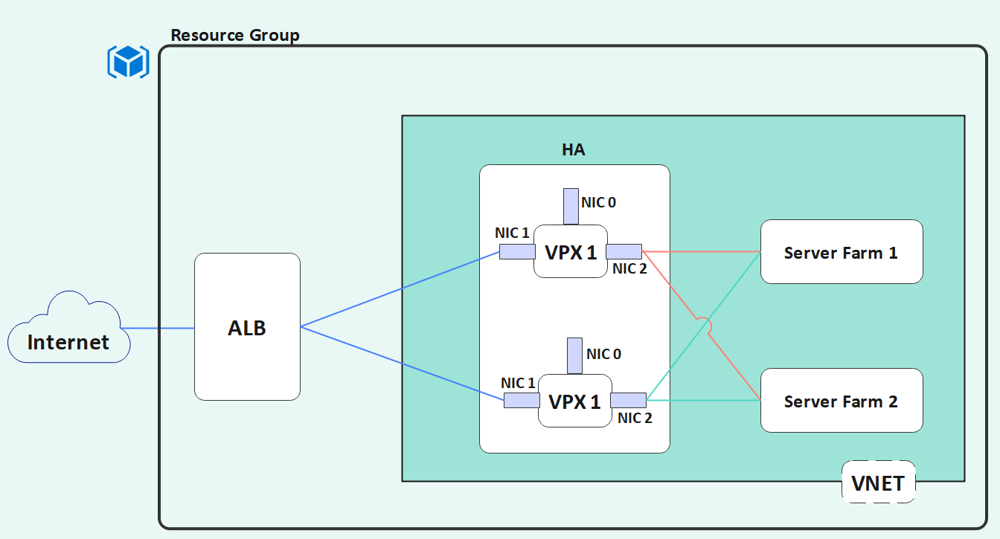

# Citrix ADC HA pair with availability set

This folder contains the configuration scripts to deploy
* A Virtual Network with 3 subnets and associated security groups and routing tables.
* Two Citrix ADC instances configured in a High Availability setup.
* A ubuntu bastion host with 1 NIC.

## Files Structure
* `main.tf` describes the actual config objects to be created. The attributes of these resources are either hard coded or looked up from input variables in `examples.tfvars`
* `variables.tf` describes the input variables to the terraform config. These can have defaults
* `versions.tf` is used to specify the contains version requirements for Terraform and providers.
* `examples.tfvars` has the variable inputs specified in `variables.tf`
* `outputs.tf` contains some outputs from the resources created in `main.tf`

## Usage

### Step-1 Install the Required Plugins
* The terraform needs plugins to be installed in local folder so, use `terraform init` - It automatically installs the required plugins from the Terraform Registry.

### Step-2 Applying the Configuration 
* Modify the `main.tf` (if necessary) and `examples.tfvars` to suit your Azure configuration and Citrix ADC deployment. 
* Use `terraform plan -var-file examples.tfvars` to review the plan
* Use `terraform apply -var-file examples.tfvars` to apply the configuration.

### Step-3 Updating your configuration
* Modify the set of resources (if necessary)
* Use `terraform plan -var-file examples.tfvars` and `terraform apply -var-file examples.tfvars` to review and update the changes respectively.

### Step-4 Destroying your Configuration
* To destroy the configuration use `terraform destroy -var-file examples.tfvars`.

# Network Architecture diagram of a high availability deployment, using Azure Availability Set

# Resource group

All resources are deployed in a single resource group.

The name of the resource group can be changed through the `resource_group_name` input variable.

# Virtual Network configuration

All network interfaces are deployed inside a single Virtual Network.

There are 3 subnets:

* Management
* Client
* Server

The Management subnet contains the ADC management interface where the NSIP address is assigned
and the interface of the ubuntu bastion host.

The Client subnet contains the ADC client interface where the VIP address is assigned.

The server subnet contains the ADC server interface where the SNIP is assigned.
Any backed service hosts deployed will need to have an interface defined within this subnet
so that the ADC can communicate with them through the SNIP address.

## Security groups

There are 3 security groups each attached to a single subnet.

The management security group contains a security rule which
allows ssh, http and https inbound traffic
from the controlling subnet.

The controlling subnet can be as restrictive as a single /32 ip address
or as permissive as 0.0.0.0/0.

The client security group allows http and https access from the internet.

The server security group restricts traffic flow within the subnet itself.
That means network interfaces belonging to this subnet will only be able to
send and receive traffic only to other interfaces inside the subnet.

# Citrix ADC configuration

The Citrix ADC instances are deployed as instances with 3 separate
NICs each in a separate subnet. 

The ADC bootstrap code will assign ip addresses to each interface
according to the ip addresses assigned by Azure.

The management network interface is where the NSIP address is assigned.
There are no additional security rules attached to the interface.
This means that access is only restricted by the subnet attached security group,
which allows access from the controlling subnet for ssh, http and https.

There is a public ip associated with this interface so that it is reachable from
outside the Virtual Network.

For enhanced security one could remove the public ip.
In such case the management interface will only be accessible from within the
Virtual Network.
This means that all ssh connections and NITRO API calls will have to go through
the bastion host.

The client network interface is where the VIP address is assigned.
This private VIP address is not used for incoming traffic since we are in an HA setup.

Instead the ip address that will be used for traffic is the public ip address of the
Azure Load Balancer. This address must be assigned to a Vserver (LB/CS) with
functioning backend services. From that point on the ALB public ip address will
start load balancing the instances.
You can find a sample LB configuration in this [folder](../simple_lb_ha)

In the case of a fail over the ALB will detect through the probe one node going down
and the secondary taking over at which point it will starting sending traffic to the
new primary node. Traffic may be impacted for a few seconds until the ALB probe
can determine the functional state of the HA pair.

There are no additional security rules attached to the interface.
This means access is only restricted by the subnet attached security group,
which allows http and https traffic from anywhere.

The server network interface is where the SNIP address is assigned.
No public ip address is associated with this interface.
There are no additional security rules attached to the interface.
This means access is only restricted by the subnet attached security group,
which only allows traffic from the subnet itself.

An SSH key is required when creating the ADC host.

Password authentication is also allowed.
Please choose a strong password to enhance security.

# Bastion host

Along with the Citrix ADC an ubuntu bastion host is deployed.

Its role is to provide access to the Virtual Network from
a secured host.

The host requires an SSH key for access.

It has a single network interface which belongs to the management subnet.
As such it can accessed form the controlling subnet.

In case the public ip address associated with the ADC management network interface
is removed the bastion host is the only other way to access the NSIP.

This means all SSH and NITRO API calls will have to be executed from
the bastion host.
