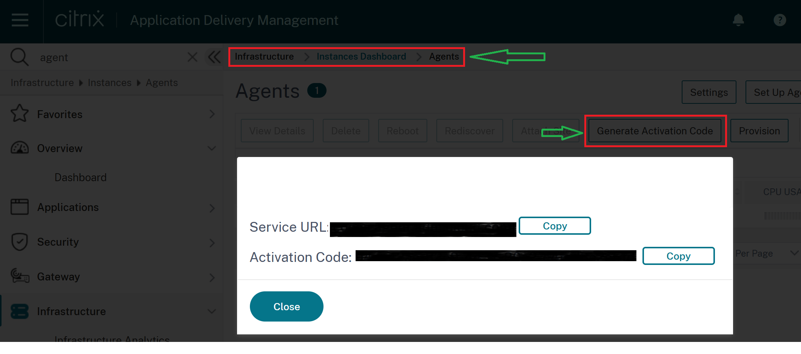

## How to Generate Activation Code in Citrix ADM Service

To Register the Citrix ADM Agent to Citrix your ADM Service, you need `serviceurl` and `activationcode` from the Citrix ADM Service. So to generate the Activation Code follow the below mentioned steps.

* Login to you Citrix ADM Service Console 
* To generate a new activation code, navigate to `Infrastructure` > `Instances` > `Agents` > `Generate Activation Code`. Refer the below Image

