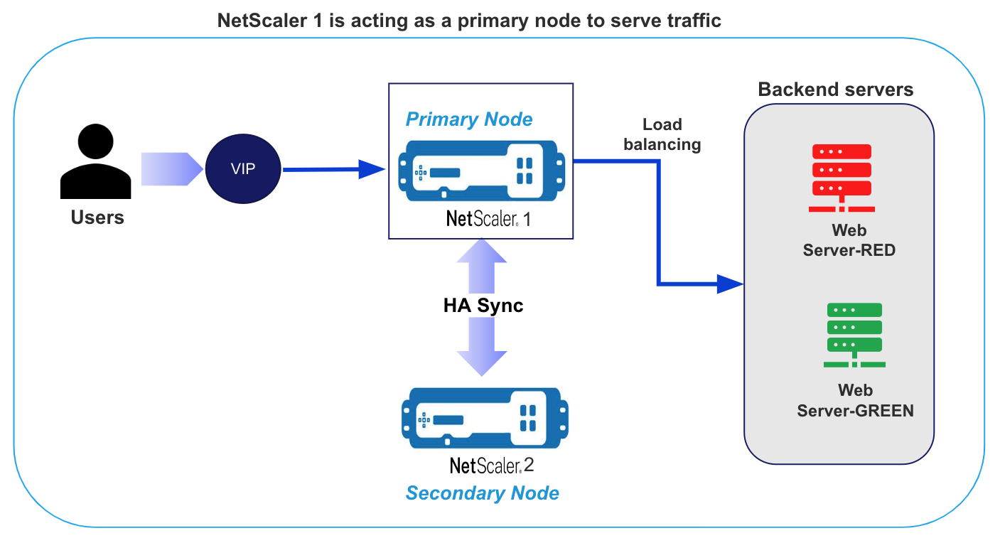
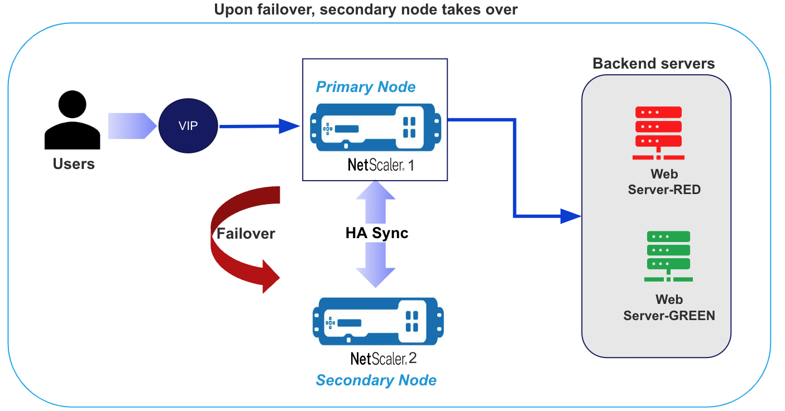
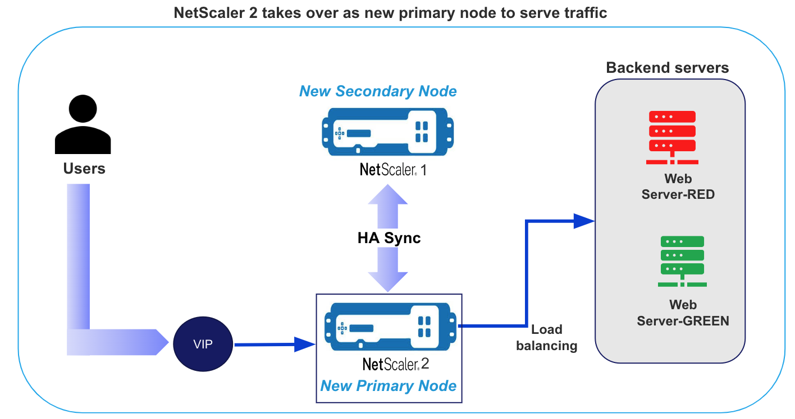

# Configure On Prem NetScaler ADCs in High Availability

These terraform scripts configures two already deployed NetScaler ADCs in High Availability.

## Pre-requisites

1. Two NetScaler ADCs to be provisioned already in the same subnet
2. Two backend webservers to be provisioned already
3. Two unallocated IPs in the same subnet
   1.  One for SNIP address
   2.  One for VIP address

## Folder Structure
There are two seperate terraform modules
1. `step1_configure_ha` helps in configuring the ADCs in HA mode
2. `step2_further_configs` helps in configuring the primary ADC after the HA mode.

Each of these terraform modules contains the below file structure -

Refer [HERE](../../assets/common_docs/folder_structure.md).

## Usage

### Step1: Configure HA

1. `cd step1_configure_ha`
2. Refer [HERE](../../assets/common_docs/terraform_usage.md) for steps

### Step2: Further Configs (Configure 1 LBvserver, 2 servers)

1. `cd step2_further_configs`
2. Refer [HERE](../../assets/common_docs/terraform_usage.md) for steps

## Network Architecture

### NetScaler1 acting as primary node to serve the traffic

### Upon failover, secondary node takes over

### NetScaler 2 takes over as new primary node to serve traffic

